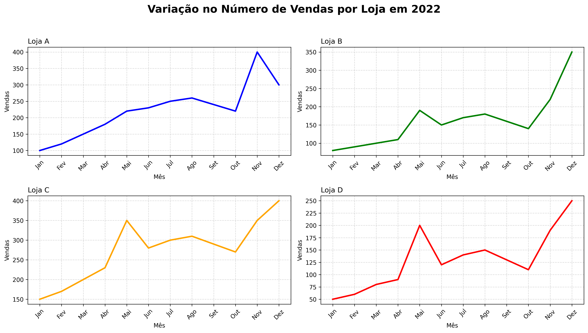

# Nesse projeto aprenderemos a configurar subplots de um grafico de: Análise Interativa de Vendas por Loja - 2022

### Algumas ideias de customização que estaremos abordando são:

* Alterar a posição dos títulos dos subplots para esquerda.
* Aumentar o tamanho da fonte do título geral da figura para destacá-lo.
* Aumentar o tamanho dos títulos e rótulos dos eixos dos subplots.
* Deixar as linhas com a espessura maior.
* Alterar a cor das linhas de cada loja para diferenciá-las ainda mais.

  


# 📊 Análise Interativa de Vendas por Loja - 2022

   

---

## 📌 Sobre

Este projeto apresenta uma análise interativa das vendas mensais de quatro lojas (A, B, C e D) ao longo do ano de 2022. Utilizando Python, Pandas, Matplotlib e Ipywidgets, o usuário pode explorar graficamente o desempenho de cada loja de forma dinâmica e intuitiva.

---

## 🚀 Funcionalidades

- Gráficos interativos para seleção da loja via dropdown.
- Visualização clara e detalhada da variação mensal das vendas.
- Opção para salvar e baixar o gráfico em alta resolução (PNG, 300 dpi, fundo branco).
- Fácil execução e compatibilidade com Google Colab.

---

## 📁 Estrutura do Projeto

- `vendas_por_loja_2022.png` – Exemplo de gráfico gerado.
- `analise_vendas_lojas.ipynb` – Notebook com código Python interativo.
- `README.md` – Documentação do projeto.

---

## 🛠 Tecnologias Utilizadas

| Tecnologia     | Versão / Detalhes              |
|----------------|-------------------------------|
| Python         | 3.7 ou superior                |
| Pandas         | Manipulação de dados           |
| Matplotlib     | Visualização gráfica           |
| Ipywidgets     | Interface interativa no notebook |
| Google Colab   | Ambiente de execução na nuvem  |

---

## 🔧 Como Executar

### 1. Clonar o Repositório

```bash
git clone https://github.com/brodyandre/analise_vendas_lojas.git
cd analise_vendas_lojas
